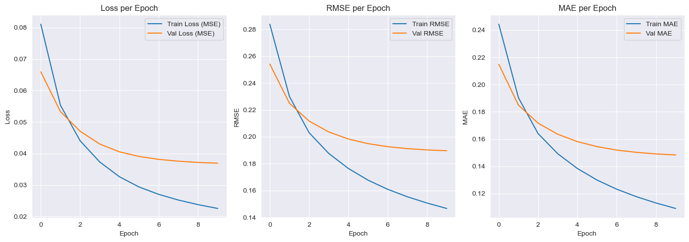

# Book Recommendation System

This project implements a **Book Recommendation System** using two main approaches: **Content-Based Filtering** and **Collaborative Filtering**. The system is built using Python and leverages machine learning techniques to recommend books based on user preferences and interactions.

## Project Overview

The system uses the [Book Recommendation Dataset](https://www.kaggle.com/datasets/arashnic/book-recommendation-dataset) from Kaggle, which contains information about books, users, and ratings. The project aims to solve the following problems:
- Helping users discover books that match their interests.
- Recommending books even when users have provided limited ratings.

### Approaches
1. **Content-Based Filtering**:
   - Uses TF-IDF and cosine similarity to recommend books based on their title and author.
   - Suitable for new users (cold start).
   - Output preview:
     - 
     - Example: For a user who likes "Harry Potter", the system recommends similar books based on title and author.

2. **Collaborative Filtering**:
   - Uses a neural network (RecommenderNet) with user and item embeddings to predict ratings.
   - Provides personalized recommendations based on user interactions.
   - Output preview:
     - 
     - Example: For a user who rated books, the system recommends other books that similar users liked.

### Evaluation Results

- RMSE: The Train RMSE and Val RMSE show a small difference, indicating the model is not overfitting.
- MAE: The Train MAE  and Val MAE  are also consistent, suggesting the model generalizes well.

Overall, training result is good because the training and testing metrics are close to each other, 
indicating that the model is not overfitting and can generalize well to unseen data.

## Dataset

- **Books**: 271,379 entries
- **Users**: 278,858 entries
- **Ratings**: 1,149,780 entries

### Key Features
- `User-ID`: Unique identifier for users.
- `ISBN`: Unique identifier for books.
- `Book-Title`: Title of the book.
- `Book-Author`: Author of the book.
- `Book-Rating`: Rating given by users.

## Installation and Setup

### Prerequisites
- Python 3.9 or higher
- TensorFlow 2.17.0
- Jupyter Notebook (optional for running `.ipynb` files)

### Installation Steps
1. Make and Activate the Environment 
```bash
python -m venv bookrec-env
source bookrec-env/bin/activate
```
2. Install Requirements
```bash
pip install -r requirements.txt
```
