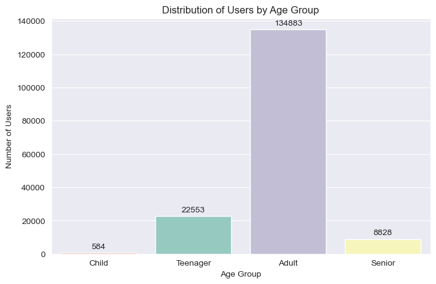
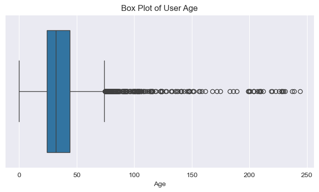
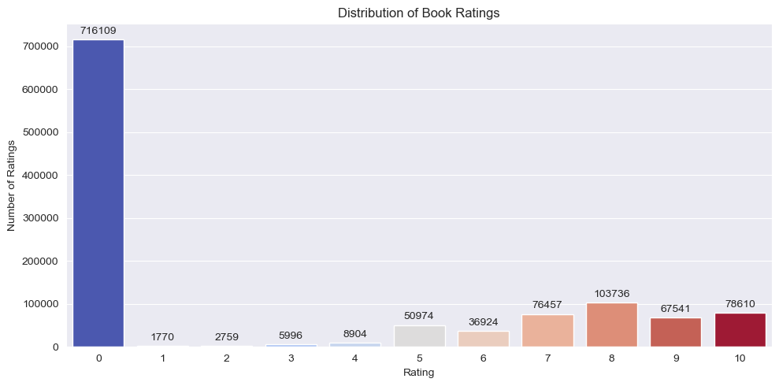
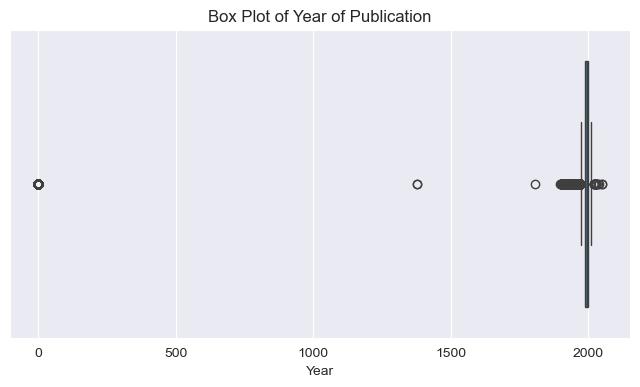
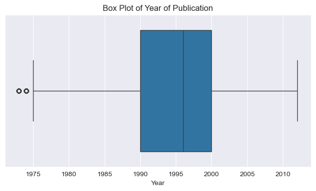
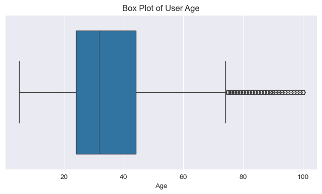
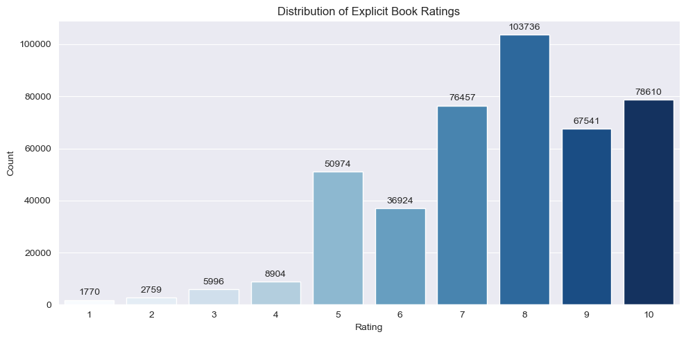
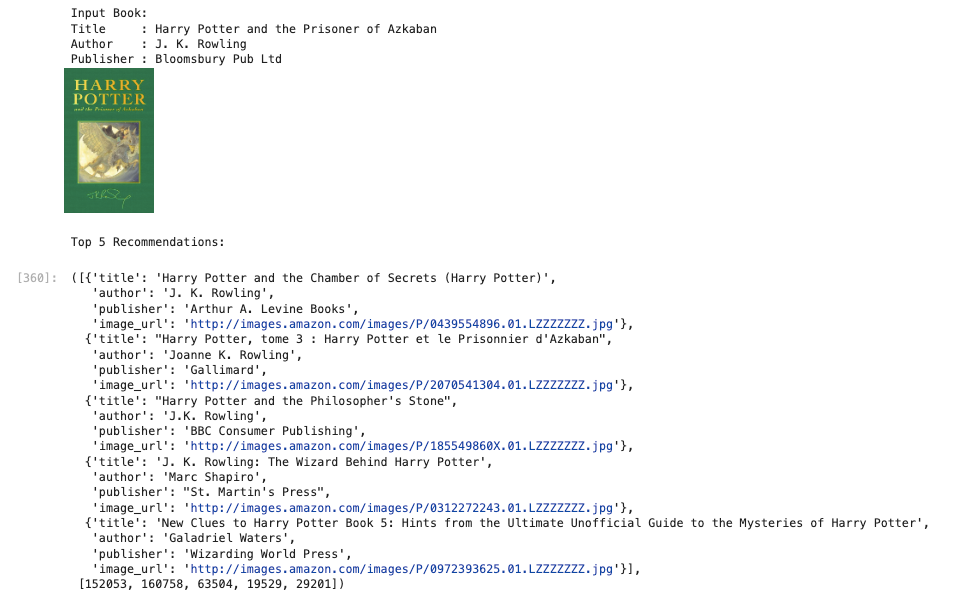
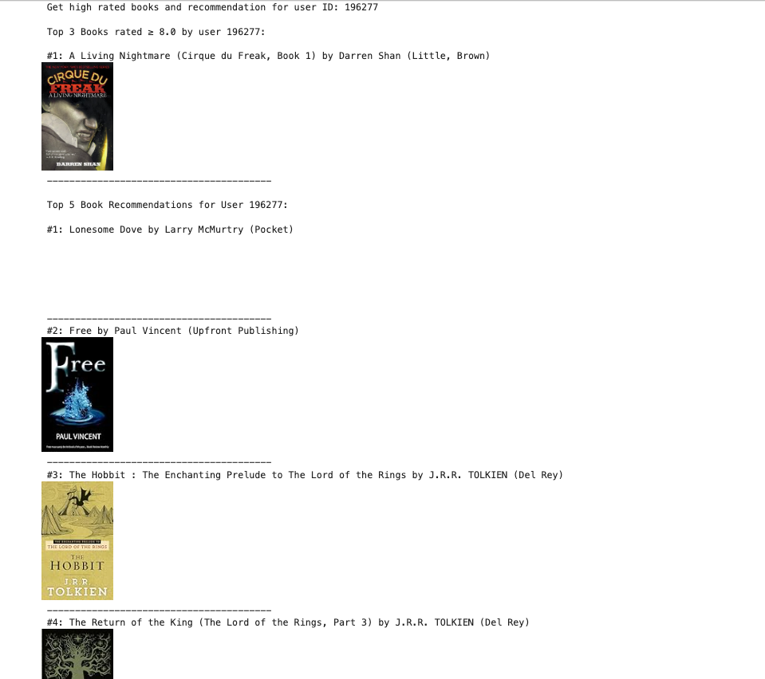
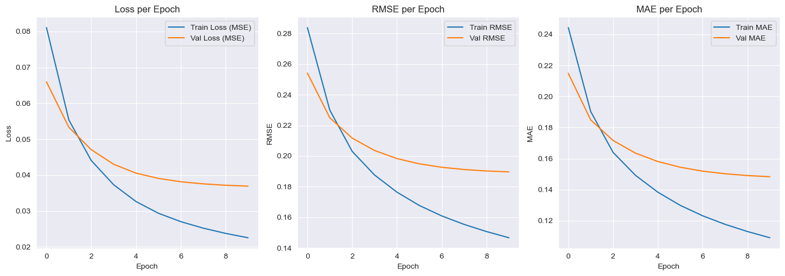

# Machine Learning Project Report - Hanuga Fathur Chaerulisma

## Project Overview

Book recommendation is one of the most practical applications in the fields of information retrieval and e-commerce. With so many books available online, users often struggle to find books that match their interests. A recommendation system helps users discover relevant books based on their preferences and behavior.

This project aims to build a machine learning-based book recommendation system using two main approaches: **Content-Based Filtering** and **Collaborative Filtering**. The system uses a public dataset from Kaggle: [Book Recommendation Dataset](https://www.kaggle.com/datasets/arashnic/book-recommendation-dataset), which contains information about books, users, and ratings.

This project is important because recommendation systems have been proven to improve user experience by offering personalized suggestions. They are widely used by platforms such as Amazon, Goodreads, and Netflix.

According to [When E-Commerce Personalization Systems Show and Tell: Investigating the Relative Persuasive Appeal of Content-Based versus Collaborative Filtering](https://doi.org/10.1080/00913367.2021.1887013), recommendation systems are effective in enhancing user engagement. Additionally, [Improving Recommender Systems using Hybrid Techniques of Collaborative Filtering and Content-Based Filtering](https://doi.org/10.47738/jads.v4i3.115) 
highlights that using Collaborative Filtering (CF) and Content-Based Filtering (CBF) techniques is enough to provide a comprehensive recommendation system.
## Business Understanding

### Problem Statements

- How can we help users discover books that match their interests?
- How can we recommend books even when users haven’t rated many of them?

### Goals

- To build a recommendation system that suggests books based on content similarity (e.g., title, author).
- To train a model that learns from user-book rating interactions to make personalized recommendations.

### Solution Approach

- **Content-Based Filtering**: Uses TF-IDF and cosine similarity based on book title and author.
- **Collaborative Filtering**: Uses a Neural Network (RecommenderNet) with user and item embeddings to predict ratings.

## Data Understanding

The dataset was obtained from Kaggle: [Book Recommendation Dataset](https://www.kaggle.com/datasets/arashnic/book-recommendation-dataset).

Data size:

- Books: 271,379 entries
- Users: 278,858 entries
- Ratings: 1,149,780 entries

Main features:

- `User-ID`: Unique user identifier
- `ISBN`: Unique book identifier
- `Book-Title`: Title of the book
- `Book-Author`: Author of the book
- `Year-Of-Publication`: Year the book was published
- `Publisher`: Publisher of the book
- `Book-Rating`: Rating score given by the user

### Exploratory Data Analysis (EDA)
1. 
Age distribution of users is imbalanced. Not only that, the user age also has a lot of outlier. 
The outlier is not make. Hence, it's need to be handled.

2. 
Many ratings were `0`, which were treated as implicit feedback and excluded from collaborative filtering. 
3. 
Outliers such in publication years are not make sense. It's need to be handled.

## Data Preparation

### Steps:
- Preprocessing Data for handling missing values and outliers:
  - Filling missing value in ` Book-Author` and `Publisher` with Unknown.
  - Because missing values on `Image-URL-L` only 1, we can drop it.
  - Removed outliers in `Year-Of-Publication` using the Interquartile Range (IQR) method.
  `Year-Of-Publication` after cleaning: 
  - In user age, we can filter data from age > 5 and < 100.
  - After that, we can fill the missing value in age using median.
    `User-Age` after cleaning: 
  - Cleaning 0 value rating on `Book-Rating`.
  `Book-Rating` after cleaning: 
- Merge all cleaning variables data to be one data using inner join.

### Reasoning:

- Encoding is required because embedding layers only accept integer inputs.
- Normalizing ratings helps the model converge more effectively during training.

## Modeling and Result

### Approach 1: Content-Based Filtering
- Removed duplicate book and rating records.
- Used TF-IDF vectorization on book title and author.
- Used cosine similarity to find books most similar to a given book.
- Output: Top-5 recommended books based on content similarity.

- Encoded `User-ID` and `ISBN` using `LabelEncoder`.
- Convert `Book-Rating` to a float type from integer.
- Normalized ratings to a 0–1 scale for the neural network model.
- Split data into training and testing sets (80:20 ratio).
**Pros**:

- Works well for new users (cold start)
- Easy to interpret (based on book features)

**Cons**:

- Ignores user behavior
- Limited to existing item features

**Output Content-Based Filtering Preview**:

### Approach 2: Collaborative Filtering (RecommenderNet)
- Data Understanding
- Data Preparation: 
    1. Encoded `User-ID` and `ISBN` using `LabelEncoder`.
    2. Rename column with easy naming
    3. Convert `Book-Rating` to a float type from integer.
- Normalized ratings to a 0–1 scale for the neural network model.
- Split data into training and testing sets (80:20 ratio).
- Used embedding layers for users and books.
- Prediction calculated using dot product + user/item bias + sigmoid activation.
- Output: Top-5 books with the highest predicted rating for a specific user.

**Pros**:

- Learns from user interaction patterns
- Produces more personalized recommendations

**Cons**:

- Can’t recommend for new users or new items
- Requires a significant amount of data to train well

**Output Collaborative Filtering Preview**:

## Evaluation

The collaborative filtering model was evaluated using two metrics:

- **Root Mean Squared Error (RMSE)**
- **Mean Absolute Error (MAE)**

### Evaluation Formulas

  

RMSE penalizes large errors more than small ones, while MAE calculates the average absolute difference without squaring the errors.

### Evaluation Results

- RMSE: The Train RMSE and Val RMSE show a small difference, indicating the model is not overfitting.
- MAE: The Train MAE  and Val MAE  are also consistent, suggesting the model generalizes well.

Overall, training result is good because the training and testing metrics are close to each other, 
indicating that the model is not overfitting and can generalize well to unseen data.
---
