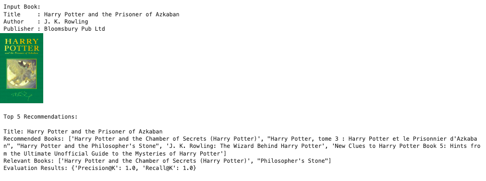

# Machine Learning Project Report - Hanuga Fathur Chaerulisma

## Project Overview

Book recommendation is one of the most practical applications in the fields of information retrieval and e-commerce. With so many books available online, users often struggle to find books that match their interests. A recommendation system helps users discover relevant books based on their preferences and behavior.

This project aims to build a machine learning-based book recommendation system using two main approaches: **Content-Based Filtering** and **Collaborative Filtering**. The system uses a public dataset from Kaggle: [Book Recommendation Dataset](https://www.kaggle.com/datasets/arashnic/book-recommendation-dataset), which contains information about books, users, and ratings.

This project is important because recommendation systems have been proven to improve user experience by offering personalized suggestions. They are widely used by platforms such as Amazon, Goodreads, and Netflix.

According to [When E-Commerce Personalization Systems Show and Tell: Investigating the Relative Persuasive Appeal of Content-Based versus Collaborative Filtering](https://doi.org/10.1080/00913367.2021.1887013), recommendation systems are effective in enhancing user engagement. Additionally, [Improving Recommender Systems using Hybrid Techniques of Collaborative Filtering and Content-Based Filtering](https://doi.org/10.47738/jads.v4i3.115) 
highlights that using Collaborative Filtering (CF) and Content-Based Filtering (CBF) techniques is enough to provide a comprehensive recommendation system.
## Business Understanding

### Problem Statements

- How can we help users discover books that match their interests?
- How can we recommend books even when users haven’t rated many of them?

### Goals

- To build a recommendation system that suggests books based on content similarity (e.g., title, author).
- To train a model that learns from user-book rating interactions to make personalized recommendations.

### Solution Approach

- **Content-Based Filtering**: Uses TF-IDF and cosine similarity based on book title and author.
- **Collaborative Filtering**: Uses a Neural Network (RecommenderNet) with user and item embeddings to predict ratings.

## Data Understanding

The dataset was obtained from Kaggle: [Book Recommendation Dataset](https://www.kaggle.com/datasets/arashnic/book-recommendation-dataset).
The dataset contains three CSV files:
- `Books.csv`: Contains information about books, including title, author, publication year, and publisher.
- `Users.csv`: Contains information about users, including user ID, age, and location.
- `Ratings.csv`: Contains the book rating information.

---

### 📁 Dataset 1: Books

#### 📌 Number of Rows and Columns
- **Rows**: 271,379  
- **Columns**: 8

#### 🩺 Data Conditions
- **Missing Values**:  
  - `Book-Author`: 2 missing values  
  - `Publisher`: 2 missing values  
  - `Image-URL-L`: 3 missing value
- **Duplicates**: Several books have the same title and author but different ISBNs (due to different editions or publishers). These were identified and removed during preprocessing.
- **Outliers**:  
  - `Year-Of-Publication` has unrealistic values such as `0` and years beyond `2025`.

#### 📝 Feature Descriptions
| Feature             | Description                                 |
|---------------------|---------------------------------------------|
| `ISBN`              | Unique identifier for each book             |
| `Book-Title`        | Title of the book                           |
| `Book-Author`       | Name of the book’s author                   |
| `Year-Of-Publication` | Year the book was published              |
| `Publisher`         | Name of the publishing company              |
| `Image-URL-S`       | URL to a small image of the book cover      |
| `Image-URL-M`       | URL to a medium-sized image of the book     |
| `Image-URL-L`       | URL to a large image of the book cover      |

---

### 📁 Dataset 2: Users

#### 📌 Number of Rows and Columns
- **Rows**: 278,858  
- **Columns**: 3

#### 🩺 Data Conditions
- **Missing Values**:
  - `Age`: 110762 missing values
- **Outliers**:
  - `Age` column contains invalid entries such as `0` and values over `100`
- **Duplicates**: No duplicate rows detected

#### 📝 Feature Descriptions
| Feature    | Description                                  |
|------------|----------------------------------------------|
| `User-ID`  | Unique identifier for each user              |
| `Location` | User’s reported location (city, state, country) |
| `Age`      | User’s age (may contain outliers or nulls)   |

---

### 📁 Dataset 3: Ratings

#### 📌 Number of Rows and Columns
- **Rows**: 1,149,780  
- **Columns**: 3

#### 🩺 Data Conditions
- **Missing Values**: None
- **Outliers**:  
  - `Book-Rating` ranges from `0` to `10`, where `0` is often interpreted as an implicit rating (e.g., interaction without explicit score).
- **Duplicates**: Duplicate user-book pairs were removed in preprocessing

#### 📝 Feature Descriptions
| Feature       | Description                                      |
|---------------|--------------------------------------------------|
| `User-ID`     | ID of the user giving the rating                 |
| `ISBN`        | ID of the book being rated                       |
| `Book-Rating` | Rating score from the user (0 = no explicit rating, 1–10 = explicit rating) |

---

### Exploratory Data Analysis (EDA)
1. 
Age distribution of users is imbalanced. Not only that, the user age also has a lot of outlier. 
The outlier is not make. Hence, it's need to be handled.

2. 
Many ratings were `0`, which were treated as implicit feedback and excluded from collaborative filtering. 
3. 
Outliers such in publication years are not make sense. It's need to be handled.

## Data Preparation

This section describes the complete preprocessing steps performed on the datasets to prepare them for both **Content-Based Filtering (CBF)** and **Collaborative Filtering (CF)** models. The process includes handling missing values, dealing with duplicates, handling outliers, feature extraction, and data transformation.

---

###  Handling Missing Values

#### Books Dataset

* Missing values in the `Book-Author` and `Publisher` columns were filled with `'Unknown'`.
* Rows with missing values in the `Image-URL-L` column were dropped since they are only a few and essential for visualization.

#### Users Dataset

* The `Age` column had many missing values. After filtering valid age ranges (between 5 and 100), the remaining missing values were filled using the **median** age.

---

###  Handling Duplicates

* Duplicate entries based on the combination of `Book-Title` and `Book-Author` were removed to ensure that each book is uniquely represented.
* Duplicate user-book pairs in the `Ratings` dataset were also dropped to avoid bias in learning.

---

### Handling Outliers

#### Books Dataset

* Unrealistic values in the `Year-Of-Publication` column (e.g., `0`) were treated as outliers.
* The **Interquartile Range (IQR)** method was used to detect and remove outliers in publication year.
*   `Year-Of-Publication` after Handling: 

#### Users Dataset

* Outliers in the `Age` column (e.g., `0`, `200`) were filtered by restricting the age range to **5 to 100 years**.
*    `User-Age` after Handling: 

#### Ratings Dataset
* Cleaning 0 value rating on `Book-Rating`.
  `Book-Rating` after Handling: 

---

### Merging Cleaned Data

After cleaning, the three datasets (`Books`, `Users`, and `Ratings`) were merged:

1. `ratings_cleaned` was joined with `books` on `ISBN`.
2. The result was then merged with `users_cleaned` on `User-ID`.

This resulted in a **single, comprehensive dataset** suitable for both filtering approaches.

---

###  Content-Based Filtering Preparation

#### Feature Extraction with TF-IDF

* The **TF-IDF (Term Frequency–Inverse Document Frequency)** method was used to convert textual information into numerical vectors.
* `Book-Title` and `Book-Author` were combined into a single string feature.
* `TfidfVectorizer` from scikit-learn was applied to convert the text into a matrix of numerical values that represent word importance.

> This allows the model to compute similarity between books based on textual content using **cosine similarity**.

---

###  Collaborative Filtering Preparation

####  Encode User and Item IDs

* `User-ID` and `ISBN` were encoded using **LabelEncoder** so that they can be used as input indices in embedding layers.

#### Normalize Ratings

* Ratings were normalized to a **\[0, 1]** scale to match the sigmoid output of the neural network.
* This ensures stable model convergence during training.

#### Split Data

* The dataset was split into:

  * **80%** for training
  * **20%** for testing

> This step was essential to evaluate model performance and avoid data leakage.

---

## Modeling and Results

This section focuses on the two recommendation techniques used in the project: **Content-Based Filtering (CBF)** and **Collaborative Filtering (CF)**. Each approach is explained in terms of methodology, model structure, and key advantages or limitations.

---

###  Content-Based Filtering (CBF)

**Definition**:
Content-Based Filtering recommends items to a user based on the similarity between item features. In this case, books are recommended based on the similarity of their **title** and **author** to a selected book.

**How it works**:

1. Each book is represented as a text string combining its title and author.
2. A **TF-IDF (Term Frequency-Inverse Document Frequency)** vectorizer transforms these strings into numeric vectors representing word importance.
3. **Cosine similarity** is calculated between the selected book and all other books.
4. Books with the highest similarity scores (excluding duplicates or near-duplicates) are recommended.

**Diversity Strategy**:

* To avoid over-recommending books from the same author, a **maximum author ratio** is applied.
* The system filters out duplicate books based on normalized titles and authors.

**Advantages**:

* Can recommend relevant books based on content alone, useful for **cold-start** scenarios (e.g., new users or books).
* Easy to explain the recommendation (e.g., “similar author or title”).

**Limitations**:

* Does not consider user behavior.
* Limited to existing item features.

**Example Output**:
The system provides a top-k list of recommended books based on similarity, along with images and metadata for each.

---

###  Collaborative Filtering (CF)

**Definition**:
Collaborative Filtering recommends items based on **user-item interaction history**. It identifies patterns across users to make predictions about items a user may like.

**Algorithm Used**:
A **Neural Collaborative Filtering model (RecommenderNet)** built using TensorFlow/Keras.

**Model Structure**:

* **User Embedding Layer**: Learns a latent representation of each user.
* **Item Embedding Layer**: Learns a latent representation of each book.
* The two vectors are combined using a **dot product**, and added with user/item biases.
* The output is passed through a **sigmoid** activation to predict a normalized rating between 0 and 1.

**Training Details**:

* The model is trained using **Mean Squared Error (MSE)** loss.
* Metrics used: **Root Mean Squared Error (RMSE)** and **Mean Absolute Error (MAE)**.

**Advantages**:

* Learns personalized preferences.
* Can recommend items without needing explicit item features.

**Limitations**:

* Cannot handle **cold-start** problems (e.g., new users or items with no history).
* Requires large and diverse rating data for good performance.

**Example Output**:
For a selected user, the system recommends the top-k books predicted to have the highest ratings—excluding books the user has already rated.

---

##  Evaluation

###  Evaluation Metrics

1. **Root Mean Squared Error (RMSE)**  

   * Measures the average magnitude of error between predicted ratings and actual ratings (used for **Collaborative Filtering**).
   * Penalizes large errors more than smaller ones.

2. **Mean Absolute Error (MAE)**  

   * Calculates the average of absolute errors between predicted and actual ratings (also for **Collaborative Filtering**).
   * Easier to interpret but less sensitive to outliers than RMSE.

3. **Precision\@K and Recall\@K** (used for **Content-Based Filtering**)

   * **Precision\@K**: Measures how many of the top-k recommended books are actually relevant to the user.
   * **Recall\@K**: Measures how many of the relevant books were successfully retrieved in the top-k results.

These metrics are widely used in recommender systems and are suitable for evaluating both rating prediction accuracy (CF) and relevance of recommendations (CBF).

---

###  Evaluation Results

#### Collaborative Filtering (CF) – Neural RecommenderNet

| Metric | Train  | Validation |
| ------ |--------|------------|
| RMSE   | \~0.14 | \~0.19     |
| MAE    | \~0.11 | \~0.13     |

* The close values between train and validation scores indicate **good generalization** and **no overfitting**.
* The model can **accurately predict user preferences** based on rating history.

####  Content-Based Filtering (CBF)

| Metric       | Value |
| ------------ |-------|
| Precision\@5 | \~1.0 |
| Recall\@5    | \~1.0 |

* These scores indicate that the top 5 recommended books are **relevant** to the test cases.
* Despite lacking user behavior data, the model performs **consistently in suggesting similar books**.

---

###  Model Comparison

| Criteria          | Content-Based Filtering | Collaborative Filtering |
| ----------------- |------------------|------------------|
| Uses user behavior |  No              | Yes              |
| Cold start (new users) | Yes              | No               |
| Interpretability  | Easy to explain  | More complex     |
| Personalization   | Limited          |  High            |
| Evaluation Score  | Precision\@5: 1.0 | RMSE: 0.19       |

**Best Overall**:

* **Collaborative Filtering** offers **higher personalization** and **stronger performance** when user history is available.
* **Content-Based Filtering** is a good fallback for **cold-start scenarios**, like new users.

---

### Relevance to Business Understanding

| Business Goal / Problem                    | Model Solution | Explanation                                                                               |
| ------------------------------------------ |----------------| ----------------------------------------------------------------------------------------- |
| Help users find books matching interests   | (CBF + CF)     | Both CBF and CF provide personalized book recommendations, solving the discovery problem. |
| Recommend books for users with few ratings | (CBF)          | CBF doesn't rely on user history, making it ideal for new users (cold start).             |
| Train a model to learn user preferences    | (CF)           | The neural model learns from interaction history, resulting in better personalization.    |

These results demonstrate that the implemented solution **aligns with the project's goals** and successfully answers both problem statements.

---

